# GCP TASK
## Create 
### 1. VPC 
### 2. two subnets (management subnet & restricted subnet):
   # 1. Management subnet has the following:
  • NAT gateway
  • Private VM
   # 2. Restricted subnet has the following:
  • Private standard GKE cluster (private control plan)
## Notes:
1. Restricted subnet must not have access to internet
2. All images deployed on GKE must come from GCR or Artifacts registry.
3. The VM must be private.
4. Deployment must be exposed to public internet with a public HTTP load balancer.
5. All infra is to be created on GCP using terraform.
6. Deployment on GKE can be done by terraform or manually by kubectl tool.
7. The code to be build/dockerized and pushed to GCR is on here:
    https://github.com/atefhares/DevOps-Challenge-Demo-Code
8. Don't use default compute service account while creating the gke cluster, create custom SA and attach it to your nodes.
9. Only the management subnet can connect to the gke cluster.

## Steps : 
1. Create a vpc 
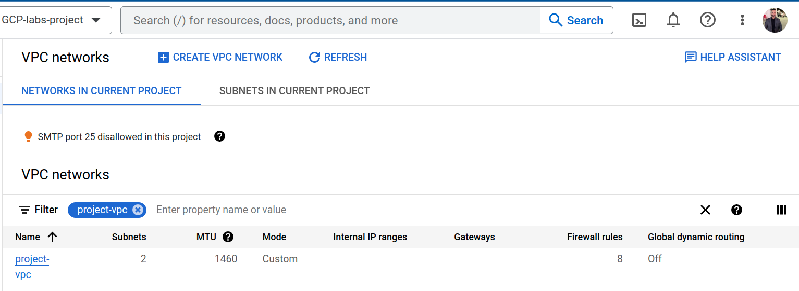
2. Create the two subnets
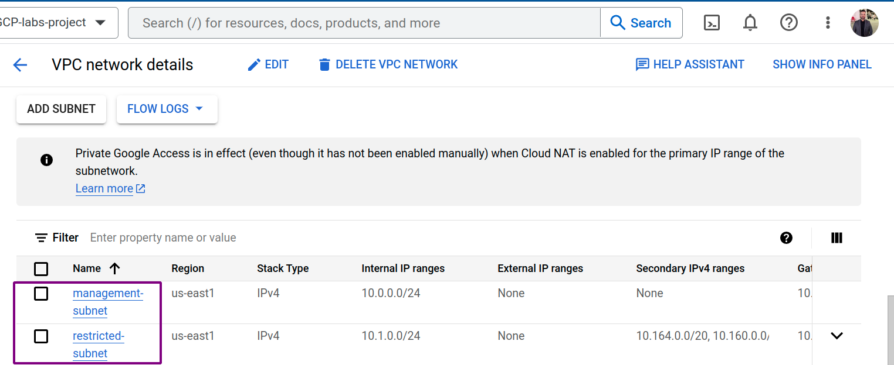
3. Create NAT
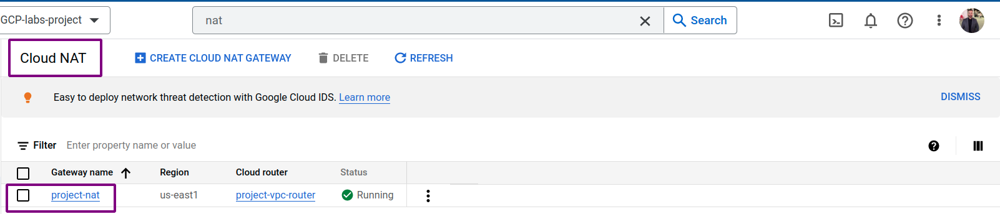
4. Create a service account

5. Create VM
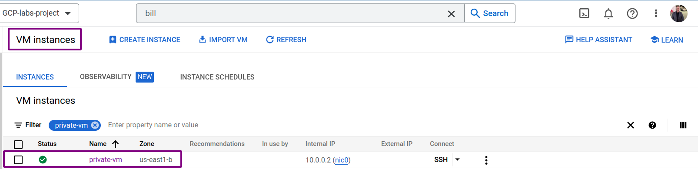
6. Create Cluster
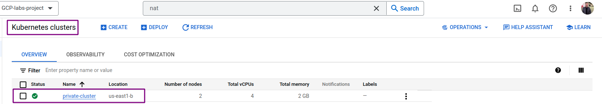
7. connect to the cluster from private-VM
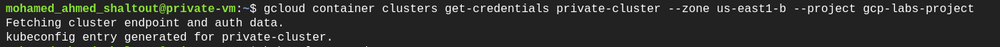
8. show worker nodes
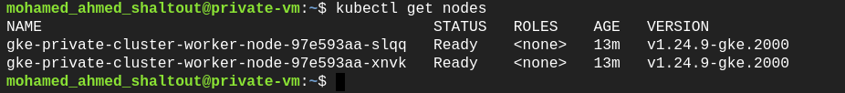
9. deployment stage
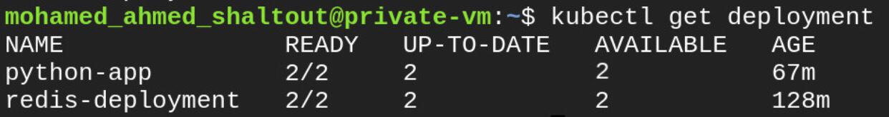
10. pods
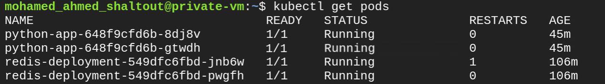
11. load balancer
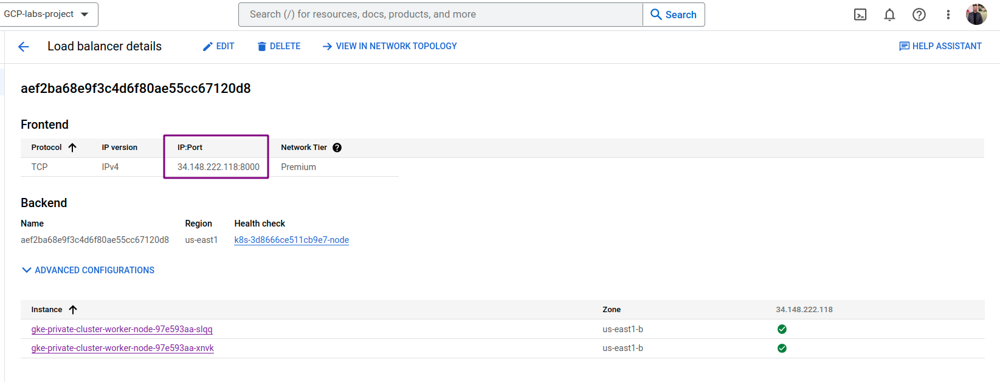
12. building python app with docker
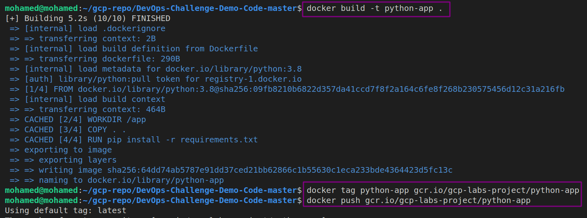
13. Images in gcr.io
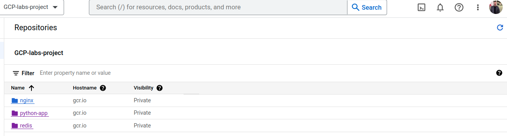
14. finale shot
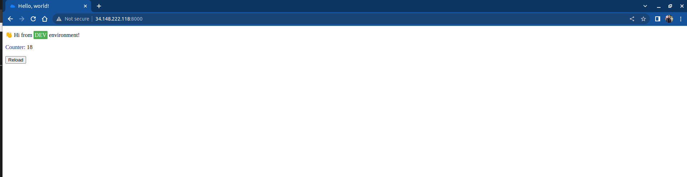
